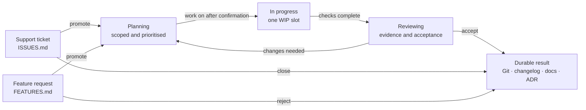

# SWE Harness

SWE Harness gives Codex and project maintainers a shared, repository-owned way
to organise software work. Project rules, tickets, decisions, and engineering
guidance stay beside the code instead of disappearing into chat history.

## How to use it

Once SWE Harness is installed, talk to Codex normally. Clear phrases at the
start of a request help it choose the right workflow:

| What you say | What happens |
| --- | --- |
| `Support ticket: checkout fails after applying a discount` | Records an issue without starting work on it |
| `Feature request: add an order history page` | Records a feature idea without implementing it |
| `Show me the open tickets` | Lists open issues across intake and the live boards |
| `Show me the open work` | Lists open issues and feature ideas across all live states |
| `Work on ISSUE-001` | Shows one plan for confirmation, then starts the item, implements it, runs checks, and moves passing work to Reviewing |
| `Work on FEATURE-001 with API and UI lanes in parallel` | Confirms one parent outcome, then gives each code-changing lane its own Git worktree and branch |
| `Review commit abc123` | Reviews that candidate without changing it |
| `Accept ISSUE-001` | Records the result and removes the completed card |
| `Prepare a release` | Checks versioning and release readiness without publishing |

Support tickets and feature requests are capture-only: Codex records them and
stops. When you are ready, say `Work on ISSUE-001`. `Start ISSUE-001` and
`Implement ISSUE-001` mean the same thing for a recorded item: Codex first asks
you to confirm the scope, checks, branch, and any required worktree. It then
moves the item through Planning and In progress, implements it, and runs the
checks. Failed or incomplete work stays In progress; passing work moves to
Reviewing. Acceptance is still a separate decision.

You can still request a status-only action such as `Promote ISSUE-001 to
Planning`, but most users should not need to manage those steps themselves.

The In progress board still contains one parent card during parallel work. If
you explicitly ask for compatible implementation lanes within that selected
item, Codex records the lanes and creates a separate Git worktree for each lane
that changes files, with each worktree checked out on its own branch. If you
name several tracked issues or features, Codex asks which identifier should be
the parent and leaves the others where they are instead of silently combining
cards. Integration remains a separate, explicitly approved step.

## Workflow

The file containing a card is its status, so there is never a second status
field to keep in sync.



There is no completed board. Accepted results live in Git history and, when
useful, the changelog, documentation, or an architectural decision record.
Small, explicitly authorised changes can be completed without creating a card.

The full lifecycle is defined in [`.agents/WORKFLOW.md`](.agents/WORKFLOW.md).

## What it adds

- A root [`AGENTS.md`](AGENTS.md) that routes each request to one focused skill.
- Repository-local skills for intake, investigation, implementation, review,
  integration, parallel work, and releases.
- Markdown queues and Planning, In progress, and Reviewing boards.
- Engineering, dependency, security, plugin, versioning, and contribution
  policy under [`.agents/`](.agents/).
- A standard-library Python CLI for safe installation, upgrade, and validation.
- A checksum manifest that protects project-owned edits during upgrades.

Repository files remain canonical. Local agent state and external trackers may
help perform work, but they do not silently replace project policy or cards.

## Install and maintain

Run the interactive initialiser from this checkout:

```sh
python3 -m swe_harness init /path/to/project
```

For automated setup, preview before applying:

```sh
python3 -m swe_harness init /path/to/project --defaults --non-interactive --require-complete --dry-run
python3 -m swe_harness init /path/to/project --defaults --non-interactive --require-complete
```

Validate or safely upgrade an installed harness:

```sh
python3 -m swe_harness validate /path/to/project --require-manifest
python3 -m swe_harness upgrade /path/to/project --defaults --non-interactive --require-complete
python3 -m swe_harness upgrade /path/to/project --defaults --non-interactive --require-complete --apply
```

Upgrade is a dry run unless `--apply` is present. Unchanged generic files can be
updated automatically; project-edited files are marked `REVIEW`, conflicts
block application, and retired files are never deleted.

## Optional Codex plugin

The optional `setup-swe-harness` skill is a thin interface over the same CLI and
template. Build the self-contained plugin with:

```sh
python3 scripts/build_plugin.py
```

The generated `dist/swe-harness/` directory is intentionally untracked.

## Maintainer map

| Concern | Canonical source |
| --- | --- |
| Reusable generic harness | [`templates/default/`](templates/default/) |
| Installation, reconciliation, and validation | [`swe_harness/`](swe_harness/) |
| Optional Codex plugin | [`plugins/swe-harness/`](plugins/swe-harness/) |
| Product contract and intent routing | [`AGENTS.md`](AGENTS.md) |
| Policy, cards, and decisions | [`.agents/`](.agents/) |

[ADR 0001](.agents/decisions/0001-repository-authority.md) explains repository
authority. [ADR 0002](.agents/decisions/0002-distribution-and-reconciliation.md)
explains distribution and safe reconciliation.

## Develop and validate

```sh
python3 -m unittest discover -s tests
python3 scripts/check_harness.py
python3 -m compileall -q swe_harness scripts plugins/swe-harness/scripts
```

## Licence

SWE Harness is available under the [MIT License](LICENSE).
