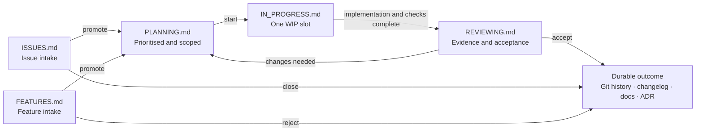

# SWE Harness

SWE Harness gives Codex and project maintainers a repository-owned way to run
software-engineering work. It keeps project rules, work cards, capability
policy, durable decisions, and release guidance beside the code they govern.

The repository remains the source of truth. Local agent state and external
trackers may help perform work, but they do not silently replace project policy
or lifecycle state.

## What it adds to a project

- A root `AGENTS.md` that routes each kind of request to one focused skill.
- Repository-local skills for intake, investigation, work management,
  implementation, review, integration, parallel coordination, and releases.
- Markdown intake queues and Planning, In progress, and Reviewing boards.
- Engineering, dependency, security, plugin, versioning, and contribution
  policy under `.agents/`.
- ADRs for durable technical decisions and a changelog for delivered behaviour.
- A deterministic standard-library Python CLI for safe installation, upgrade,
  and validation.
- Installation provenance in `.agents/HARNESS.json`, allowing generic template
  updates to be reconciled without overwriting project-owned edits.

## Work workflow

The location of a card is its status. Items move between canonical Markdown
files; they are never copied into a second board or mirrored into a status
field.



There is no completed board. Accepted results live in Git history and, where
appropriate, the changelog, documentation, or an ADR. Small, explicitly
authorised changes can be completed without a card; durable tracking is used
when work must survive the current task, compete for priority, coordinate
parallel lanes, or await later acceptance.

[`.agents/WORKFLOW.md`](.agents/WORKFLOW.md) is the canonical contract for card
fields and transitions.

## Intent-specific skills

Each operation has one owner so that answering a question cannot silently turn
into implementation, and implementation authority cannot silently turn into a
merge, push, or release.

| Intent | Owning skill |
| --- | --- |
| Capture an explicit issue, bug, task, or feature request | [`capture-project-intake`](.agents/skills/capture-project-intake/SKILL.md) |
| Investigate, explain, compare, audit, or plan | [`investigate-project`](.agents/skills/investigate-project/SKILL.md) |
| List or transition recorded work | [`manage-project-work`](.agents/skills/manage-project-work/SKILL.md) |
| Coordinate explicitly requested parallel lanes | [`coordinate-parallel-work`](.agents/skills/coordinate-parallel-work/SKILL.md) |
| Implement, fix, refactor, test, or change dependencies | [`develop-project`](.agents/skills/develop-project/SKILL.md) |
| Review a defined candidate change | [`review-project-change`](.agents/skills/review-project-change/SKILL.md) |
| Integrate an accepted and reviewed candidate | [`integrate-reviewed-change`](.agents/skills/integrate-reviewed-change/SKILL.md) |
| Prepare versions, release notes, tags, or publication | [`release-project`](.agents/skills/release-project/SKILL.md) |

The root [`AGENTS.md`](AGENTS.md) owns the routing and safety boundaries. Each
skill owns only the procedure for its intent.

## Install into a project

Run the interactive initialiser from this checkout:

```sh
python3 -m swe_harness init /path/to/project
```

It asks for missing project facts, refuses to overwrite different existing
content, and records checksums for the files it installs. For an automated
setup, preview conservative defaults before applying them:

```sh
python3 -m swe_harness init /path/to/project --defaults --non-interactive --require-complete --dry-run
python3 -m swe_harness init /path/to/project --defaults --non-interactive --require-complete
```

Validate an installed harness:

```sh
python3 -m swe_harness validate /path/to/project --require-manifest
```

## Upgrade safely

An upgrade is a dry run unless `--apply` is present:

```sh
python3 -m swe_harness upgrade /path/to/project --defaults --non-interactive --require-complete
python3 -m swe_harness upgrade /path/to/project --defaults --non-interactive --require-complete --apply
```

The reconciler automatically replaces only files that still match their
recorded installation checksum. Project-edited files are marked `REVIEW`,
conflicts block application, and retired template files are never deleted.

## Optional Codex plugin

The optional plugin provides the `setup-swe-harness` skill as a thin interface
over the same CLI and canonical template. It does not add an MCP server,
external tracker, custom UI, or second template copy.

Build a self-contained plugin directory:

```sh
python3 scripts/build_plugin.py
```

The generated `dist/swe-harness/` directory is intentionally untracked. The
source checkout and built plugin expose the same `init`, `upgrade`, and
`validate` commands.

## Repository map

Each concern has one canonical owner. [ADR 0001](.agents/decisions/0001-repository-authority.md)
records why authority stays in the repository, and
[ADR 0002](.agents/decisions/0002-distribution-and-reconciliation.md) records
the distribution and reconciliation model.

| Concern | Canonical source |
| --- | --- |
| Reusable generic harness | [`templates/default/`](templates/default/) |
| Rendering, reconciliation, and validation | [`swe_harness/`](swe_harness/) |
| Optional Codex plugin | [`plugins/swe-harness/`](plugins/swe-harness/) |
| Product contract and intent routing | [`AGENTS.md`](AGENTS.md) |
| Harness navigation and policy | [`.agents/`](.agents/) |
| Intake queues | [`.agents/ISSUES.md`](.agents/ISSUES.md) and [`.agents/FEATURES.md`](.agents/FEATURES.md) |
| Selected work | [`.agents/workboard/`](.agents/workboard/) |
| Durable decisions | [`.agents/decisions/`](.agents/decisions/) |
| Delivered changes | [`CHANGELOG.md`](CHANGELOG.md) |

Rendered target repositories own their project-specific choices. The checksum
manifest is provenance for safe reconciliation, not a claim that generated
files outrank project edits.

## Develop and validate

SWE Harness uses only Python's standard library. Run the full project gate with:

```sh
python3 -m unittest discover -s tests
python3 scripts/check_harness.py
python3 -m compileall -q swe_harness scripts plugins/swe-harness/scripts
```

The test suite includes a clean, self-contained plugin build and install. The
validator checks canonical sources, internal links, unresolved project setup,
tracked-identifier uniqueness, the WIP limit, skill-name uniqueness, and
installation metadata integrity.

## Licence

SWE Harness is available under the [MIT License](LICENSE).
